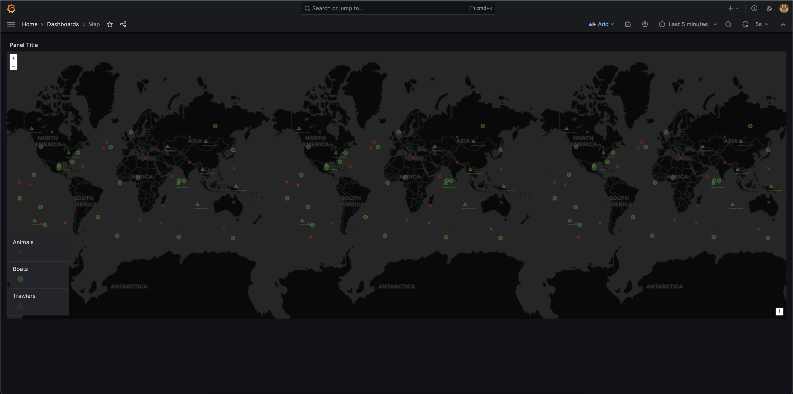

# Ocean Sentinel: Behaviour Enabled IOT for Conservation Of Marine Animals

  

### Rationale
To promote behaviour-enabled IOT, our application leverages the power of IOT devices to track, analyse, and visualize animal behaviour as well as the behaviour of industrial trawlers and locaal boats.

### Problem Description
Often, endangered marine animals are found as by-catch in industrial trawlers which results in loss of lives of these marine animals due to corporate negligence. We seek to change this with our project. Additionally, local boats, intentionally or unintentionally encroach the biodiveristy hotspots reserved in oceans towards marine conservation. The noise pollution and unchecked tourism/fishing activities on these boats are often a source of distress and harrasssment towards endangered marine animals, leading to them deserting these hotspots.

_The overview of the concept of implementing our project can be found below_:

**Group Members:**
1. Sherkhan Azimov
2. Aarohi Garg
3. Vidya Dhopate
4. Jacob White

**Submitted To:**

Prof. Henry Muccini

## Built with

[![Docker][Docker.com]][Docker-url][![Python][Python.org]][Python-url][![MQTT][MQTT.com]][MQTT-url][![InfluxDB][InfluxDB.com]][InfluxDB-url][![Grafana][Grafana.com]][Grafana-url][![Telegram][Telegram.org]][Telegram-url]

<!-- MARKDOWN LINKS & IMAGES -->
[React.js]: https://img.shields.io/badge/React-20232A?style=for-the-badge&logo=react&logoColor=61DAFB
[React-url]: https://reactjs.org/
[Python.org]: https://img.shields.io/badge/python-3670A0?style=for-the-badge&logo=python&logoColor=ffdd54
[Python-url]: https://www.python.org/
[MUI.com]: https://img.shields.io/badge/MUI-%230081CB.svg?style=for-the-badge&logo=mui&logoColor=white
[MUI-url]: https://mui.com/
[MQTT.com]: https://camo.githubusercontent.com/7032ff43ba978eff463cbbd12e4f747102e73b3cd71bc626171e1e0487099432/68747470733a2f2f696d672e736869656c64732e696f2f7374617469632f76313f7374796c653d666f722d7468652d6261646765266d6573736167653d4d51545426636f6c6f723d363630303636266c6f676f3d4d515454266c6f676f436f6c6f723d464646464646266c6162656c3d
[MQTT-url]: https://mqtt.org/
[Docker.com]: https://img.shields.io/badge/docker-%230db7ed.svg?style=for-the-badge&logo=docker&logoColor=white
[Docker-url]: https://www.docker.com/
[FastAPI.com]: https://img.shields.io/badge/FastAPI-005571?style=for-the-badge&logo=fastapi
[FastAPI-url]: https://fastapi.tiangolo.com/
[InfluxDB.com]: https://img.shields.io/badge/InfluxDB-22ADF6?style=for-the-badge&logo=InfluxDB&logoColor=white
[InfluxDB-url]: https://www.influxdata.com/
[Nodered.org]: https://camo.githubusercontent.com/dba888e83b867790301211b790aa54bbcd0829d8b87d9601adc04bc1d408c4f6/68747470733a2f2f696d672e736869656c64732e696f2f7374617469632f76313f7374796c653d666f722d7468652d6261646765266d6573736167653d4e6f64652d52454426636f6c6f723d384630303030266c6f676f3d4e6f64652d524544266c6f676f436f6c6f723d464646464646266c6162656c3d
[Nodered-url]: https://nodered.org/
[Grafana.com]: https://camo.githubusercontent.com/bc49cd42967fc5be8c364ddf4fa16008584815a3bec1d461dfc5c7214b345238/68747470733a2f2f696d672e736869656c64732e696f2f7374617469632f76313f7374796c653d666f722d7468652d6261646765266d6573736167653d47726166616e6126636f6c6f723d463436383030266c6f676f3d47726166616e61266c6f676f436f6c6f723d464646464646266c6162656c3d
[Grafana-url]: https://grafana.com/
[Telegram.org]: https://camo.githubusercontent.com/64952244a7851ce3715dd9c8f3cb88673be00c8583f283192fd8c2cec645be7a/68747470733a2f2f696d672e736869656c64732e696f2f7374617469632f76313f7374796c653d666f722d7468652d6261646765266d6573736167653d54656c656772616d26636f6c6f723d323641354534266c6f676f3d54656c656772616d266c6f676f436f6c6f723d464646464646266c6162656c3d
[Telegram-url]: https://telegram.org/
[Telegraf.org]: https://camo.githubusercontent.com/38de238268b31df333bd3bdca46953582a42b528390cef904aea00660d0b918d/68747470733a2f2f696d672e736869656c64732e696f2f7374617469632f76313f7374796c653d666f722d7468652d6261646765266d6573736167653d54656c65677261706826636f6c6f723d323232323232266c6f676f3d54656c656772617068266c6f676f436f6c6f723d464146414641266c6162656c3d
[Telegraf-url]: https://www.influxdata.com/time-series-platform/telegraf/